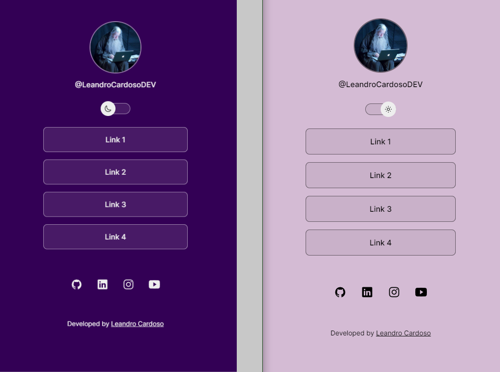

# Estudo de HTML, CSS, JavaScript, Git e GitHub - Básico

### [🔑 MIT License](https://github.com/Leandro-Cardoso/STUDY-HTML-CSS-JavaScript-Git-GitHub/blob/master/LICENSE)

[🌎 **LINK DO PROJETO**](https://Leandro-Cardoso.github.io/STUDY-HTML-CSS-JavaScript-Git-GitHub/projeto/)

    <h2>Sobre</h2>

Estudo de nível iniciante feito através do curso "discover" da Rocketseat de 5h. 
[Rocketseat - discover](https://www.rocketseat.com.br/discover)

    

### ⚙️ Tecnologias:
* HTML e CSS
* JavaScript
* Git e GitHub

### ⚙️ Módulos:
1. Primeiros passos.
2. Aprendendo a aprender.
3. Iniciando o HTML e CSS.
4. Avançando o HTML e CSS.
5. JavaScript.
6. Git e GitHub.

    <h2>Autor</h2>
    
    <h3>Leandro Cardoso</h3>

